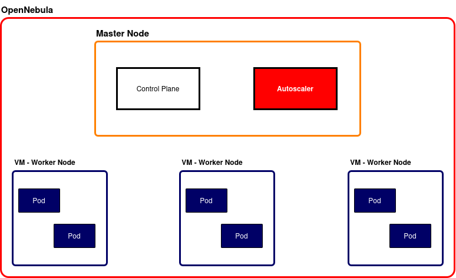

<h1 align="center"> NodeFitter </h1>

<p align="center"> A simple OpenNebula VM autoscaler </p>

<div align="center">
  
</div>

<div align="center">
  
  
</div>

## About this project
<div align="center">

</div>

NodeFitter is a simple VM autoscaler created for the "Fog and Cloud Computing" course at the <a href="https://www.unitn.it/it">University of Trento</a>, Italy.

NodeFitter is capable of automatically scaling VMs running on OpenNebula. Specifically, the scaler automatically spawns one VM per template upon startup, then continues to check the internal VM memory and CPU consumption.

When the free memory or the CPU is under a configurable threshold, NodeFitter automatically creates a new VM of the same type and automatically makes the VM join the Kubernetes cluster.

The script used to obtain information about memory and CPU consumption is uploaded to the new VM, meaning that it is completely configurable. As for the Kubernetes auto-join functionality, NodeFitter automatically generates a 10-minute token and registers it with the control plane.

## Installation instructions

> [!IMPORTANT]
> Before installing and setting up the NodeFitter autoscaler be sure to have ALREADY set up OpenNebula's templates and VM groups. Additionally, an active control plane must already exist. For more information, read the [appropriate README](./VMsConfig/README.md)

To set up Docker and Kubernetes, as well as the necessary OpenNebula templates and golden images, it is sufficient to follow the instructions reported in the [appropriate README](VMsConfig/README.md) under the <a href="./VMsConfig/">VMsConfig folder</a>.

As for the installation of the NodeFitter applications, a [`docker compose`](https://github.com/NodeFitter/Submission/blob/main/nodefitter/compose.yml) file, along with the appropriate [`dockerfile`](https://github.com/NodeFitter/Submission/blob/main/nodefitter/dockerfile) is available in the [`Submission` repository](https://github.com/NodeFitter/Submission). To run it, it is sufficient to clone the repository with:

```sh
git clone --recurse-submodules https://github.com/NodeFitter/Submission.git
```

Before starting NodeFitter, please read the configuration section of this document.

## Configuration instructions

NodeFitter needs some parameters configured in order to properly work. Specifically, NodeFitter will read the parameters in the file `schedulerConfig.yml`, placed under the [`config` folder](./config), which also contains some example.

```yaml
user: "on-username" # Username of OpenNebula user, needed to connect to OpenNebula via OpenNebula's APIs
password: "on-password" # Password of OpenNebula user, needed to connect to OpenNebula via OpenNebula's APIs
endpoint: "http://192.0.2.3:2633/RPC2" # OpenNebula's endpoint, needed to connect to OpenNebula via OpenNebula's APIs. :2633/RPC2 is MANDATORY
res_script_path: "./vms/res_info.sh" # Path of the file (file included) needed to collect memory and CPU measurements that will be uploaded to every newly created VMs

kubernetes_config_path: "./config/kubernetes-config.yml"  # Kubernetes configuration file. A copy of the needed config can be found under .kube/config or /etc/kubernetes/admin.conf in the control plane node
kubernetes_ca_certificate_path: "./certs/ca.crt" # Kubernetes CA file used during Kubernetes' join token creation. Certificate can be found under /etc/kubernetes/pki/ca.crt of control plane
kubernetes_endpoint: 192.0.2.1:6443 # Address of Kubernetes, used for token generation and cluster node deletions. DO NOT USE localhost, as the same address will also be used by the newly created VMs in order for them to contact the control plane and join the cluster. :6443 is MANDATORY

free_ram_threshold: 100 # If a VMs tell a quantity of free memory UNDER OR EQUAL to the provided number, a new VM with the same template will be instantiated
free_CPU_threshold: 9.5 # If a VMs tell a quantity of free CPU UNDER OR EQUAL to the provided percentage, a new VM with the same template will be instantiated
schedule_check_interval: 180 # How many seconds the scaler needs to wait before scanning the VMs and check wether new VMs are needed or need to be stopped. Must be a positive integer different from 0
schedule_preserve_VM_timeout: 600 # How many seconds the scaler needs to preserve a VM before it is considerate as a candidate to be removed from the scheduler. Must be a positive integer different from 0
max_VM_qt: 3 # How many VMs can be currently present NOT in the POWEROFF or in the UNDEPLOYED state. In other words, if the scaler verifies that are currently present x >= max_VM_qt VMs NOT in POWEROFF or UNDEPLOYED state, the autoscaler will NOT create any new VMs
```

As it is possible to read from the shown configuration file, it is necessary to also retrieve some Kubernetes-specific files. Examples of such files can be found in the [`config` folder](./config) and the [kubernetesCert](./kubernetesCert/) folders.

## Usage instructions

To start NodeFitter, simply execute:

```sh
# Move to the nodefitter folder of the cloned repository
cd nodefitter

# Run the docker compose
docker compose -f compose.yml up
```

Docker will automatically build and start the autoscaler, along with the setup of the Unix socket to allow connection with the [ScalerCtl](github.com/NodeFitter/ScalerCtl).

Once activated, no further interaction is needed: NodeFitter will automatically start to work according to the provided configuration. It is possible to start, stop and partially change the scaler configuration by using the ctl. For additional information, read the [ScalerCtl README](https://github.com/NodeFitter/ScalerCtl/blob/main/README.md).

## Authors

- GitHub: <a href="https://github.com/LorenzoCaraffini">LorenzoCaraffini</a>
- GitHub: <a href="https://github.com/FireStoat3">FireStoat3</a>
